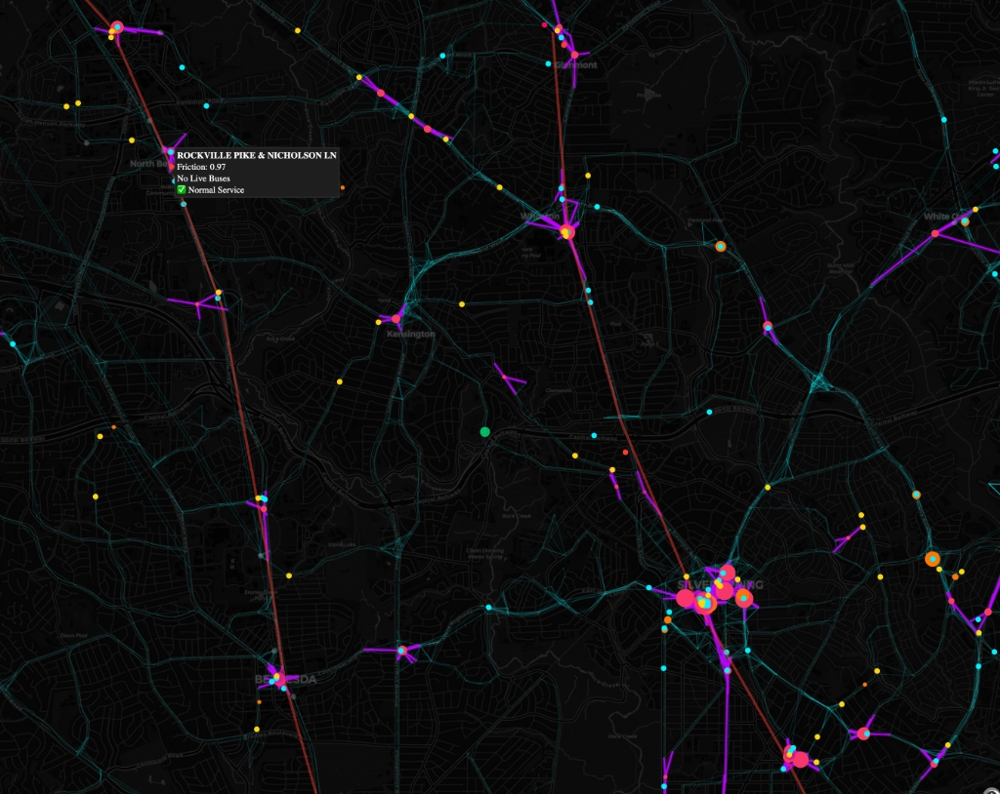
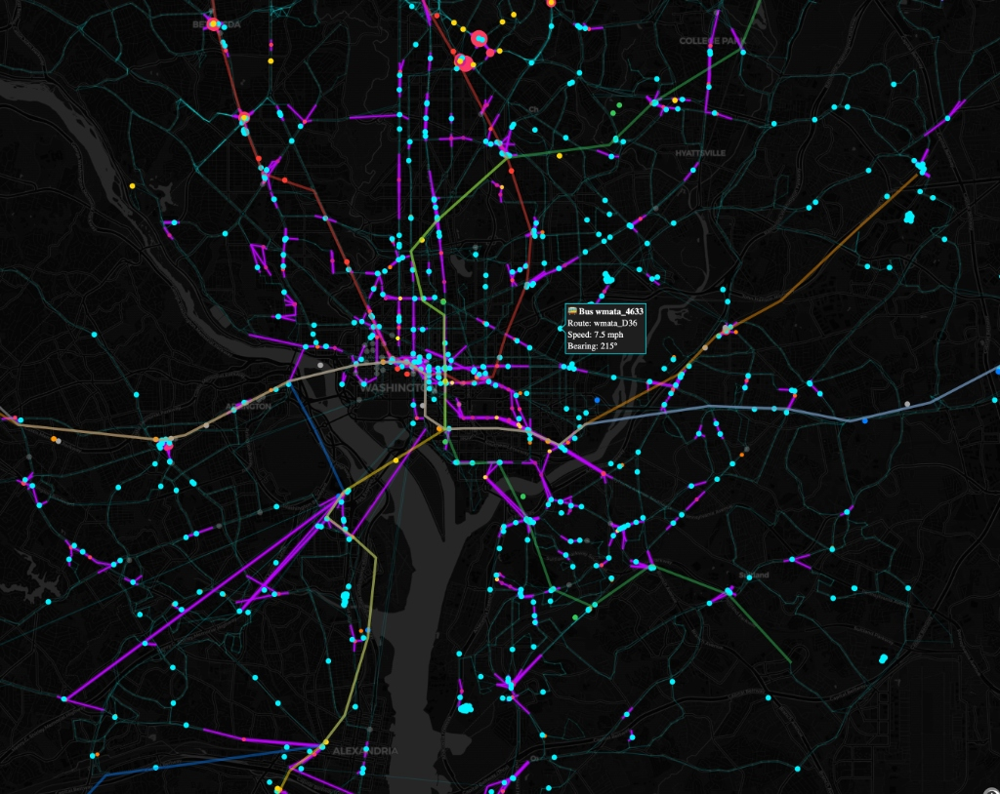
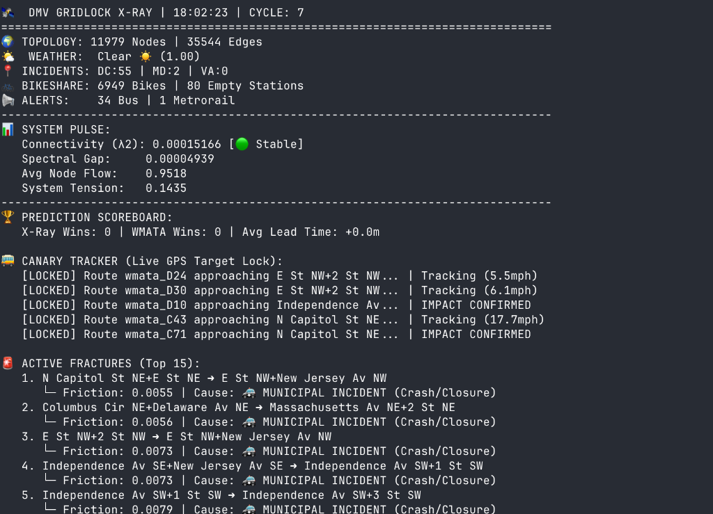
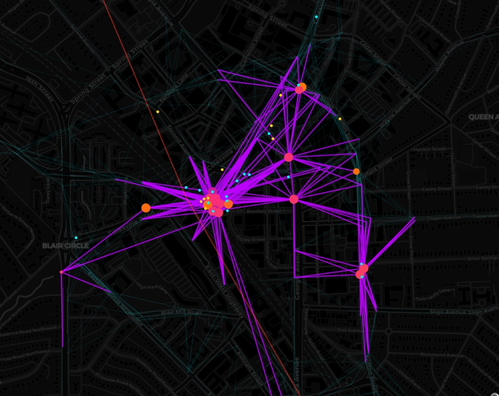
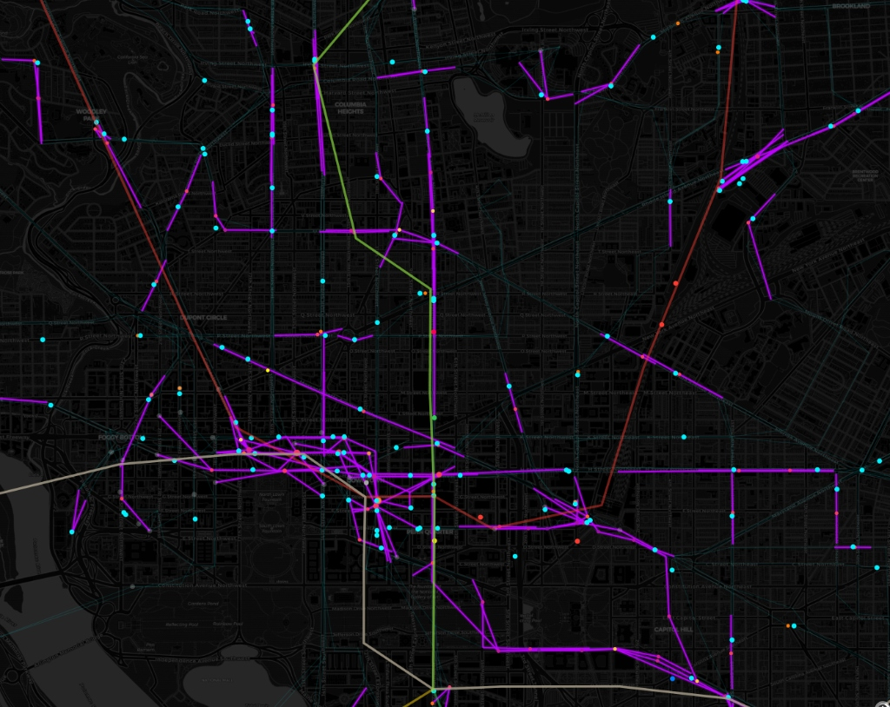
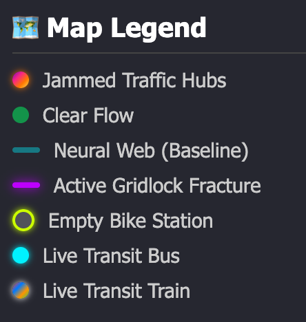
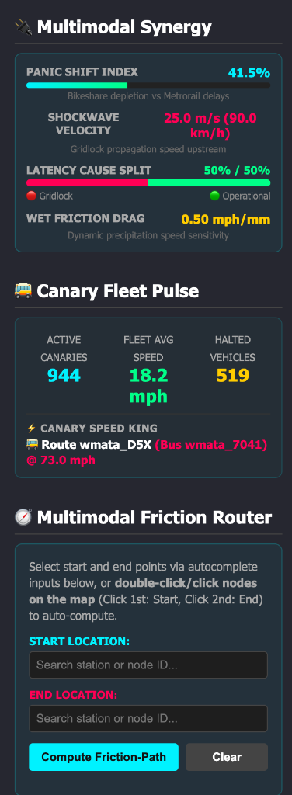
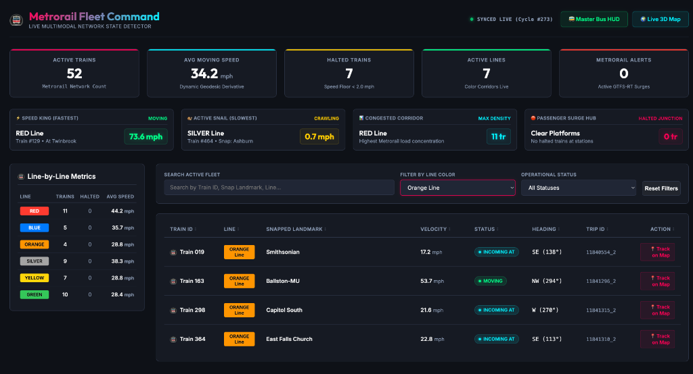
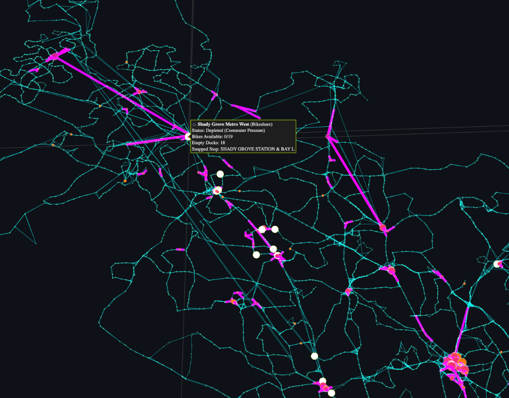
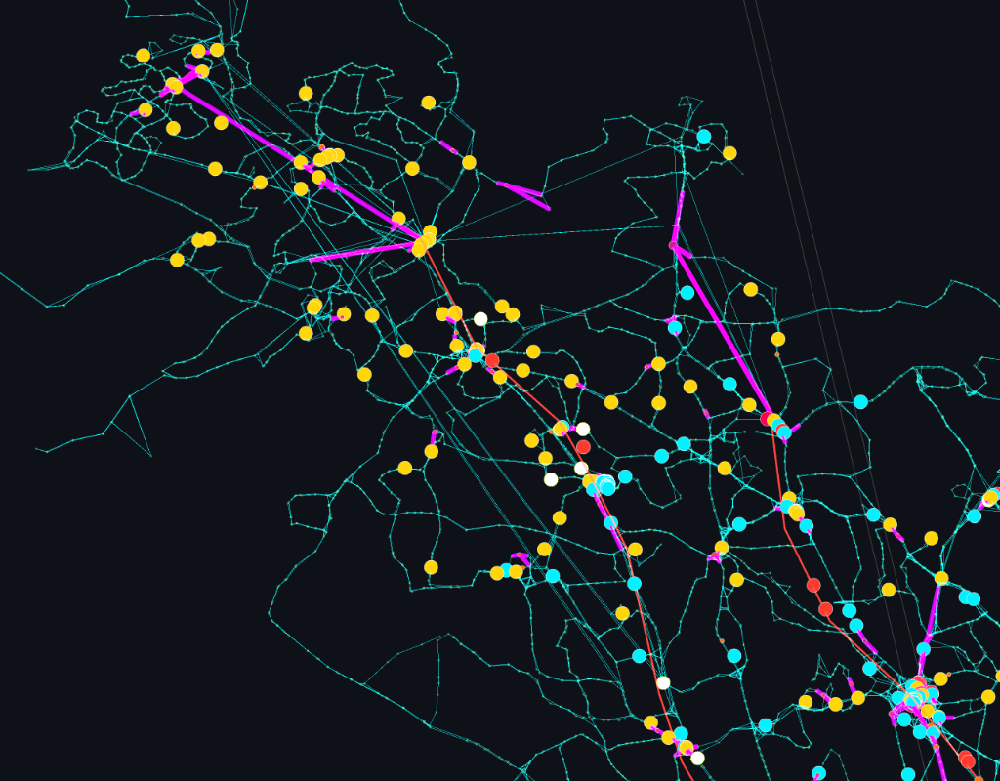

# DMV Gridlock X-Ray 📡🚇🚌

<p align="center">
  
</p>

DMV Gridlock X-Ray is a real-time mathematical topology engine and 3D visualization command dashboard for the Washington D.C. metropolitan transit network (WMATA and Montgomery County RideOn). Rather than plotting vehicle locations as static markers, it models the entire transit grid as a live **sparse mathematical matrix**, computing systemic congestion and network fractures using Spectral Graph Theory.

Every 30 seconds, the engine builds a dynamic Graph Laplacian from live transit, weather, incident, and micro-mobility feeds, calculating the network's algebraic connectivity ($\lambda_2$, the "Fiedler value"). This allows dispatchers to detect and route around structural gridlock minutes before human operators issue official bulletins.

---

## 🔬 Project Research Status

> **Note**: DMV Gridlock X-Ray is an **experimental research project** investigating the application of Spectral Graph Theory, sparse linear algebra, and Graph Heat Diffusion Kernels to real-time municipal public transit networks. It acts as an active proof-of-concept modeling DMV transit grids as a live, friction-scaled Graph Laplacian, and is not an officially endorsed service of the WMATA or Montgomery County transit authorities.

---

## 📊 Dashboard Preview

| 3D Spectral Topology Visualization | Multimodal Gridlock Diagnostics HUD | Canary Fleet Command HUD |
|:---:|:---:|:---:|
|  |  |  |

### 🗺️ Local Area & Network Core Views

| Rockville Pike & Nicholson Lane View | Washington D.C. Core Network View |
|:---:|:---:|
|  |  |

### 🎛️ HUD Panels & Fleet Command Views

| Map Legend | Dynamic HUD Panels | Metrorail Fleet Command |
|:---:|:---:|:---:|
|  |  |  |

### 🚲 Bikeshare & Network Topology Details

| Bikeshare Station Depletion | Wide Area Network Overview |
|:---:|:---:|
|  |  |

---


## 🚀 Key Features

*   **Spectral Congestion Solver**: Evaluates the network-wide Graph Laplacian matrix to extract $\lambda_2$ and the spectral gap ($\lambda_3 - \lambda_2$), identifying topological boundaries of systemic traffic failure.
*   **Multimodal Routing Engine**: A custom Dijkstra routing implementation over an augmented graph of streets (Road) and subways (Rail), including dynamic transfer penalties scaled by weather and congestion.
*   **Emergency Shuttle Bridge Routing**: Auto-detects partition boundaries when $\lambda_2 < 10^{-4}$ and solves for the closest high-traffic hubs across the fracture to route emergency shuttle vehicles (`/api/bridge`).
*   **RideOn & WMATA Fusion**: Fully integrates Montgomery County RideOn static GTFS topology and live GTFS-RT telemetry under strict rate limits ($\le 3\text{ req/min}$ per link, minimum $20\text{s}$ interval, $\le 10\text{ req/min}$ overall), including inter-operator walk-transfer edges ($\le 150.0\text{m}$ for routing, $\le 300.0\text{m}$ for giant component topology).
*   **Interactive 3D WebGL Dashboard**: Elegant visualization of network node elevations repelled by spectral isolation values ($z_i = 150 \cdot v_{2, i}$), featuring dynamic edge fracture lines and quadratic Bezier curves for express commuter arcs.
*   **Kinematic Dead-Reckoning**: Runs client-side physics interpolation to animate buses and trains smoothly between 15-second server heartbeats.
*   **Canary Protocol & Adjudication**: Automatically tracks buses approaching gridlock and logs predictive performance against official bulletins to calculate lead time.

---

## 🛰️ Streamlit 3D Topological Terrain Visualizer

The Streamlit application (`viz.py`) provides an interactive, diagnostic-heavy 3D visualization dashboard of the transit network's spectral topology. It interfaces directly with the processing engine via `network_state.npz` and `sim_state.json` using atomic cross-process file locks.

### Features
*   **3D Spectral Neural Web**: Renders the complete, live transit topology. Edge weights are color-coded, and node heights ($z_i$) are scaled by their Fiedler vector coordinates ($z_i = 150 \cdot v_{2,i}$), visually projecting structural isolation as peaks rising from the ground plane.
*   **Interactive Simulation Lab**: Allows dispatchers to simulate localized network failures. Users can select any stop node from a dropdown and click **Inject Critical Failure** to clamp that stop's friction score to $0.05$ (writing atomically to `sim_state.json`). Clicking **Clear Simulations** restores normal tracking.
*   **Live System Diagnostics Panel**: Displays live telemetry in the sidebar, including:
    *   **λ2 Health (Fiedler Value)**: Measures systemic cohesion, showing real-time trends (↗️ Improving, ↘️ Degrading, ➡️ Stable).
    *   **Regional Weather Drag**: Active precipitation reports and global friction multipliers.
    *   **Jurisdictional Incidents**: Active incident counts in DC, MD, and VA.
    *   **Bikeshare Depletion**: Real-time count of empty bikeshare hubs.
    *   **Active WMATA Alerts**: Stream of official transit bulletin updates.
*   **Rendering & View Controls**:
    *   **Connection Density Slider**: Adjusts neural web lines from 0.1x to 1.0x to reduce GPU render load.
    *   **Fracture Sensitivity Slider**: Custom threshold slider to debug edge bisection boundaries.
    *   **Camera Angle Locking**: Employs camera coordinate persistence (`uirevision`) to preserve user rotate/pan zoom levels across automatic data refreshes.

---

## 📐 Mathematical Formulation

### The Graph Laplacian
Congestion is modeled by symmetric scaling of the unweighted topological layout $W_{\text{mask}}$ with a dynamic node friction array $f_i \in [0.01, 1.0]$:
$$W = \text{diag}(f) \cdot W_{\text{mask}} \cdot \text{diag}(f)$$
This scales edge weights as $W_{ij} = f_i \cdot W_{ij} \cdot f_j$, where a lower score indicates worse congestion. The Graph Laplacian $L$ is computed as:
$$L = D - W \quad \text{where} \quad D_{ii} = \sum_{j} W_{ij}$$

### Algebraic Connectivity ($\lambda_2$)
The system runs a sparse eigensolver to compute the eigenvalues of $L$:
$$0 = \lambda_1 \le \lambda_2 \le \lambda_3 \le \dots \le \lambda_n$$
*   $\lambda_2$ (the Fiedler Value) measures systemic network cohesion. When $\lambda_2 < 10^{-4}$, the transit network has mathematically fractured into isolated sub-graphs.
*   $\lambda_3 - \lambda_2$ (the Spectral Gap) quantifies structural stability and vulnerability to cascading local disruptions.

### Centrality-Adjusted Edge Fractures
A street connection (edge) is flagged as fractured if its joint weight drops below a centrality-adjusted threshold:
$$\text{Threshold}_{ij} = 0.4 \cdot (1.0 + \gamma \cdot (1.0 - \text{mean}(C_i, C_j)))$$
where $\gamma = 0.50$ (`GAMMA_CENTRALITY`) and $C_i$ is the normalized degree centrality. This keeps threshold sensitivity at $0.40$ in highly redundant urban centers but raises it to $0.60$ in isolated suburban corridors.

---

## 🛠️ Data Ingestion Registry

The ingestion loop (`engine.py`) collects and synthesizes data from 8 distinct feeds:
1.  **WMATA Metrobus GPS (GTFS-RT Protocol)**: Fetches positions every 15s to update local bus speeds and track active "canary" vehicles.
2.  **WMATA Metrorail GPS (GTFS-RT Protocol)**: Fetches underground train statuses every 30s, applying a "Precision Ground Zero" surge penalty ($0.60$ friction multiplier) within 500m of halted underground trains.
3.  **Capital Bikeshare GBFS (REST JSON)**: Snaps bike station statuses every 120s to capture localized transit hub failures via dock depletion ($< 2$ bikes).
4.  **Municipal Incidents (REST GeoJSON)**: Scrapes DC HSEMA and Maryland CHART police closure/incident feeds every 300s to clamp matching stops to a structural floor ($f_i = 0.05$).
5.  **Open-Meteo Weather (REST JSON)**: Polls precipitation metrics every 15 minutes to adjust system-wide "weather drag."
6.  **WMATA Service Alerts (GTFS-RT Protocol)**: Polled every 5 minutes to verify X-Ray engine predictions against human dispatcher notifications.
7.  **RideOn Bus Static GTFS Topology (Zip CSV)**: Fuses Montgomery County static route files at startup, injecting walking transfer edges within $300\text{ meters}$ to form the Giant Connected Component.
8.  **RideOn Bus GPS & Delays (JSON REST Protocol)**: Polled dynamically under rate limits to update the regional congestion friction map, snapping coordinates without stop IDs via a KDTree query ($< 0.001^{\circ}$).

---

## ⚙️ Setup & Installation

### Prerequisites
*   Python 3.10 or higher
*   A WMATA Developer Key (Register at [developer.wmata.com](https://developer.wmata.com))
*   Montgomery County RideOn API credentials (`RIDEON_API_KEY` and `RIDEON_CLIENT_ID`)

### 1. Clone & Initialize Environment
Clone the repository and initialize a Python virtual environment:
```bash
git clone <repository_url>
cd bustracker
python3 -m venv venv
source venv/bin/activate
```

### 2. Install Dependencies
Install the required scientific computing, web, and rendering dependencies:
```bash
pip install -r requirements.txt
```

### 3. Configure API Credentials & Environment Variables
To enable real-time ingestion of vehicle positions, route delays, and service alerts, you must configure the following environment variables. Export them before running the backend processing engine:
*   `WMATA_API_KEY`: Developer key acquired from [developer.wmata.com](https://developer.wmata.com) to access the WMATA GTFS-RT Protobuf streams and Metrobus/Metrorail telemetry APIs.
*   `RIDEON_API_KEY`: Montgomery County API key to authenticate and query RideOn Bus GPS vehicle positions and trip updates JSON endpoints.
*   `RIDEON_CLIENT_ID`: Montgomery County Developer Portal client ID required in standard HTTP header payloads alongside `RIDEON_API_KEY`.

```bash
export WMATA_API_KEY="your_developer_key_here"
export RIDEON_API_KEY="your_rideon_api_key_here"
export RIDEON_CLIENT_ID="your_rideon_client_id_here"
```

### 4. Automatic Static GTFS Management
The application manages static GTFS schedule topology automatically on startup. During the initialization phase, the engine checks for the existence of the static GTFS files in:
*   `gtfs/wmata/`
*   `gtfs/rideon/`

If these files are missing or incomplete, the application will automatically download, extract, and compile the base topological road and rail graph files. **No manual download or extraction of static GTFS ZIP archives is required.**

---

## 🚦 Running the Application

For a fully active system, you must run the backend processing engine, the HTTP web server, and the Streamlit 3D visualizer concurrently.

### 1. Start the Processing Engine
The engine handles real-time API scraping, Laplacian math calculations, and exports state files:
```bash
# In Terminal 1 (with venv activated)
python engine.py
```

### 2. Start the Web Server
The server hosts the HTML/WebGL dashboard interface and provides routing endpoints:
```bash
# In Terminal 2 (with venv activated)
python server.py
```
Once active, navigate to **`http://localhost:8501`** in your browser to view the client-side WebGL dashboard.

### 3. Start the Streamlit 3D Visualizer
To view the 3D topological terrain graph with live bisection and failure injection controls:
```bash
# In Terminal 3 (with venv activated)
streamlit run viz.py --server.port 8502
```
Once active, navigate to **`http://localhost:8502`** in your browser.

*Note: Specifying `--server.port 8502` prevents port collisions since the web server defaults to `8501`.*

---

## 📡 API Reference

### 1. Dijkstra Multimodal Router
*   **Path**: `/api/route`
*   **Method**: `POST`
*   **Payload**:
    ```json
    {
      "start_lat": 38.9072,
      "start_lon": -77.0369,
      "end_lat": 38.8977,
      "end_lon": -77.0059
    }
    ```
*   **Description**: Calculates the optimal path between coordinates over the dynamic, friction-adjusted road-and-rail graph.

### 2. Emergency Shuttle Bridge Router
*   **Path**: `/api/bridge`
*   **Method**: `POST`
*   **Description**: Solves the spectral bisection of the network graph (when $\lambda_2 < 10^{-4}$) and returns routing path instructions for establishing an emergency shuttle bridge between high-traffic hubs across the partition boundary.

### 3. Simulation Injection
*   **Path**: `/api/inject`
*   **Method**: `POST`
*   **Payload**: `{"node_id": "stop_node_id_here"}`
*   **Description**: Forces the specified stop's friction score to $0.05$ to simulate a localized road closure.

### 4. Clear Simulation State
*   **Path**: `/api/clear`
*   **Method**: `POST`
*   **Description**: Removes all injected simulation failures and restores baseline graph tracking.

---

## 📚 Developer Guides

*   [Extending Feeds and Sensors](docs/extending_feeds.md): Learn how to add new dynamic feeds or physical sensors, update friction penalties, and recalculate Laplacian weights.
*   [Porting to Other Cities](docs/adapting_transit_systems.md): A step-by-step blueprint on adapting the Graph Laplacian engine and WebGL visualizer to NYC (MTA) or other transit networks around the country.

---

## 📄 License

This project is licensed under the MIT License - see the [LICENSE](LICENSE) file for details.
